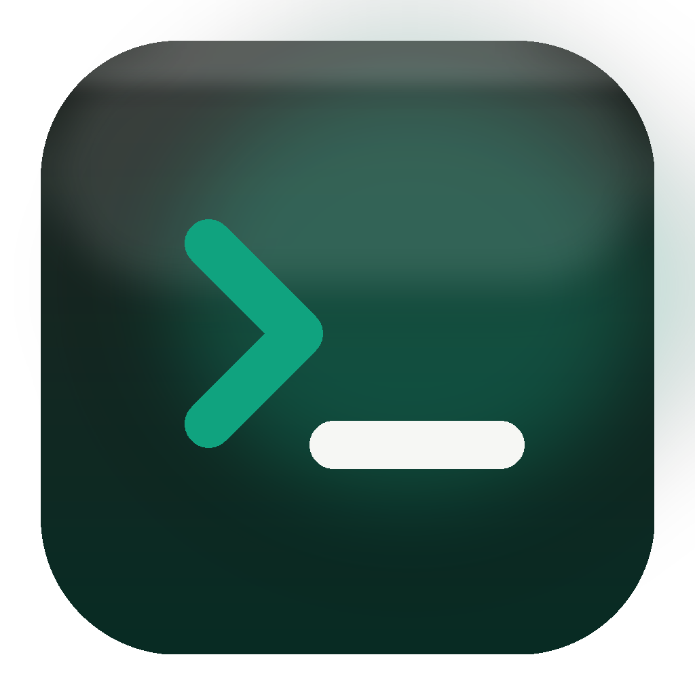

# CodexUsage



Native macOS menu bar app for local Codex usage.

CodexUsage reads Codex's local rollout logs at `~/.codex/sessions/**/rollout-*.jsonl`
and `~/.codex/archived_sessions/rollout-*.jsonl`. It uses the latest `token_count`
event that includes `rate_limits`.

- Shows the 5-hour Codex session window and weekly window from local `rate_limits`
- OpenAI-style menu bar mark with orange percentage, switching to red above 90%
- Notifications at 80% and 95% per window, with hysteresis so they do not spam
- Optional Launch at Login
- No org ID, no session token, no Keychain credential, no network calls

---

## Download & run

1. Download [`release/CodexUsage-OpenAI.zip`](release/CodexUsage-OpenAI.zip), or build from source.
2. Unzip it and drag `CodexUsage-OpenAI.app` into `/Applications`.
3. Because this personal build is not signed with a paid Apple Developer ID, macOS may refuse to open it on first run. Run:

```bash
xattr -dr com.apple.quarantine /Applications/CodexUsage-OpenAI.app
```

Or right-click the app, choose **Open**, then confirm.

Usage appears after Codex has written at least one local `token_count` event.

---

## Build from source

Requirements: macOS 14 or later, Xcode, and XcodeGen (`brew install xcodegen`).

```bash
cd CodexUsage
chmod +x build.sh
./build.sh
ditto -x -k CodexUsage.zip /Applications/
open /Applications/CodexUsage.app
```

---

## Project layout

```text
CodexUsage/
├── project.yml                # XcodeGen project definition
├── build.sh                   # one-shot build script
├── make_icon.py               # icon generator
├── AppIcon.icns               # bundled app icon
├── CodexUsageApp.swift        # @main entry
├── AppDelegate.swift          # app-level hooks
├── MenuBarLabelView.swift     # the percentage shown in the menu bar
├── MenuBarContentView.swift   # dropdown content
├── SettingsView.swift         # settings window
├── UsageViewModel.swift       # polling, state, notifications
├── UsageClient.swift          # Codex JSONL parser
├── UsageData.swift            # data models
├── NotificationManager.swift  # banner notifications
└── LaunchAtLogin.swift        # SMAppService toggle
```

## Troubleshooting

- **No Codex rollout logs found**: use Codex once so it writes a local session log.
- **No Codex rate-limit events found yet**: run a Codex turn that reaches a `token_count` event, then refresh.
- **App is damaged and can't be opened**: remove the quarantine flag with the command above.
- **Percentages look stale**: CodexUsage reads local logs; it updates when Codex writes a new `token_count` event.

## License

MIT — see [LICENSE](LICENSE).
